# TravelMemory MERN Deployment on AWS using Terraform and Ansible

## Project Overview

This project demonstrates the deployment of a MERN stack application on
AWS using **Terraform** for infrastructure provisioning and **Ansible**
for configuration management and application deployment.

The application used for this assignment is the public **TravelMemory**
MERN application. The deployment separates the application and database
tiers across public and private AWS subnets and applies multiple layers
of security.

### Objectives

-   Provision AWS infrastructure using Infrastructure as Code (IaC) with
    Terraform.
-   Create a VPC containing public and private subnets.
-   Deploy a public EC2 instance for the web/application tier.
-   Deploy a private EC2 instance for MongoDB.
-   Configure Internet Gateway, NAT Gateway, route tables, Security
    Groups, and IAM.
-   Configure both EC2 instances using Ansible.
-   Deploy the React frontend and Node.js/Express backend.
-   Install and secure MongoDB.
-   Serve the application through Nginx.
-   Apply host-level and AWS-level security controls.
-   Demonstrate a working end-to-end MERN application.

------------------------------------------------------------------------

## Source Application

TravelMemory repository:

`https://github.com/UnpredictablePrashant/TravelMemory`

The application consists of:

-   **Frontend:** React
-   **Backend:** Node.js / Express
-   **Database:** MongoDB

The backend runs on port `3001` internally and connects to MongoDB on
port `27017`.

------------------------------------------------------------------------

## Architecture

``` text
                             INTERNET
                                 |
                                 |
                         Internet Gateway
                                 |
                                 v
                    +-------------------------+
                    |      Public Subnet      |
                    |      10.0.1.0/24        |
                    |                         |
User ---- HTTP:80 ->|   Web EC2 Instance     |
Admin --- SSH:22 -->|   Nginx                |
                    |   React Production UI   |
                    |   Node.js / Express     |
                    |        :3001            |
                    +------------+------------+
                                 |
                                 | MongoDB :27017
                                 | SSH :22 (management)
                                 v
                    +-------------------------+
                    |      Private Subnet     |
                    |      10.0.2.0/24        |
                    |                         |
                    |   Database EC2          |
                    |   MongoDB :27017        |
                    +------------+------------+
                                 |
                                 | outbound Internet
                                 v
                           NAT Gateway
                                 |
                         Internet Gateway
```

### Application Request Flow

``` text
Browser
   |
   | HTTP :80
   v
Nginx
   |
   +------ / ----------------> React static build
   |
   +------ /api/* -----------> Express :3001
                                  |
                                  | authenticated connection
                                  v
                             MongoDB :27017
```

Nginx is the only public HTTP entry point. Node.js port `3001` is not
exposed publicly in the final configuration.

------------------------------------------------------------------------

# Part 1 - Infrastructure Setup with Terraform

## 1. AWS CLI Configuration

AWS CLI was configured locally and authenticated against the AWS
account.

Example verification command:

``` bash
aws sts get-caller-identity
```

This verifies that the local environment can communicate with AWS using
the configured credentials.

### Evidence

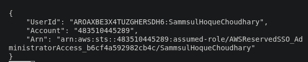

------------------------------------------------------------------------

## 2. Terraform Initialization

The Terraform project was initialized using:

``` bash
terraform init
```

Terraform downloaded the required AWS provider and initialized the
working directory.

### Evidence

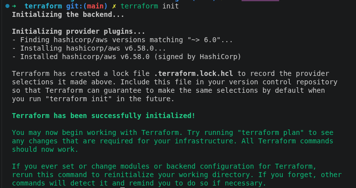

The Terraform configuration was then validated:

``` bash
terraform fmt
terraform validate
```

### Evidence

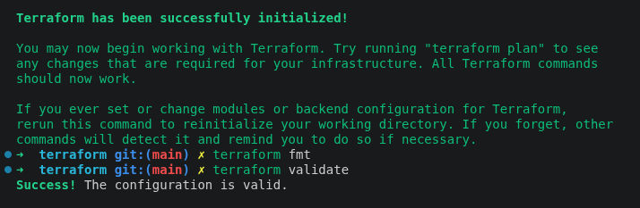

------------------------------------------------------------------------

## 3. VPC and Network Configuration

A custom AWS VPC was provisioned with CIDR:

``` text
10.0.0.0/16
```

Two subnets were created:

  Subnet           CIDR            Purpose
  ---------------- --------------- ---------------------
  Public Subnet    `10.0.1.0/24`   Web/application EC2
  Private Subnet   `10.0.2.0/24`   MongoDB EC2

The public subnet allows public IP assignment, whereas the private
subnet does not.

An Internet Gateway was attached to the VPC for public internet
connectivity.

A NAT Gateway was deployed in the public subnet so that the private
database instance can initiate outbound internet connections for package
installation and updates without accepting inbound connections directly
from the internet.

### Evidence

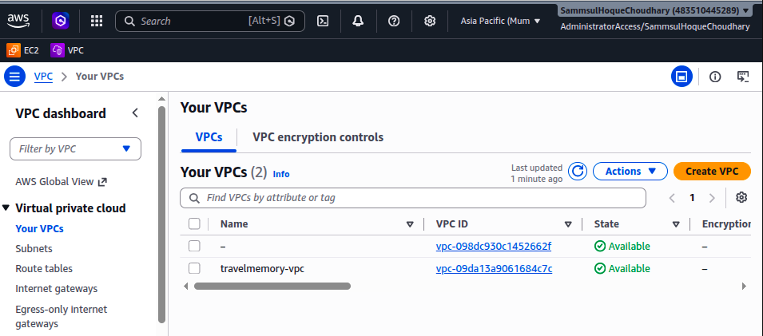

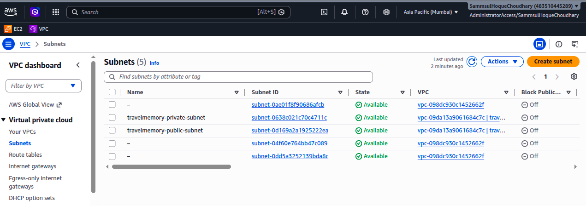

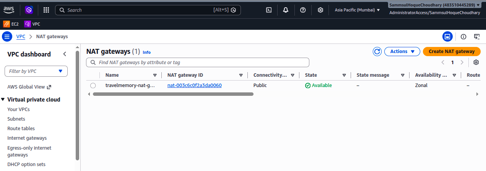

------------------------------------------------------------------------

## 4. Route Tables

Two route tables were configured.

### Public Route Table

``` text
10.0.0.0/16 -> local
0.0.0.0/0   -> Internet Gateway
```

This route table is associated with the public subnet.

### Private Route Table

``` text
10.0.0.0/16 -> local
0.0.0.0/0   -> NAT Gateway
```

This route table is associated with the private subnet.

The design allows the MongoDB EC2 instance to download software updates
while remaining inaccessible directly from the public internet.

### Evidence

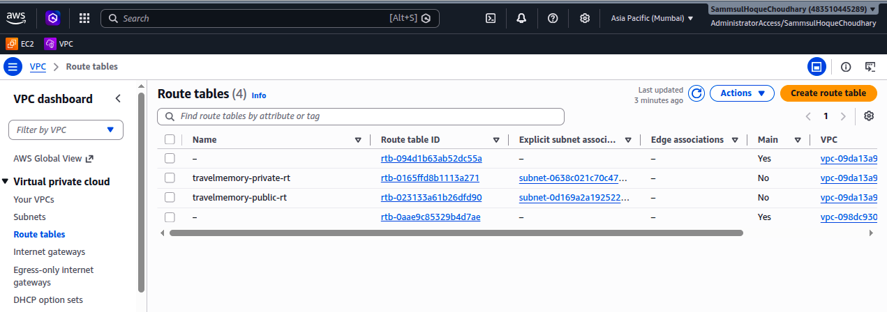

------------------------------------------------------------------------

## 5. EC2 Provisioning

Terraform provisioned two Ubuntu EC2 instances.

### Web Server

-   Located in the public subnet.
-   Has a public IPv4 address.
-   Runs React, Node.js/Express, and Nginx.
-   SSH access is restricted to the administrator's current public IP.

### Database Server

-   Located in the private subnet.
-   Has no public IPv4 address.
-   Runs MongoDB.
-   SSH and MongoDB access are permitted only from the web-server
    security group.

### Evidence

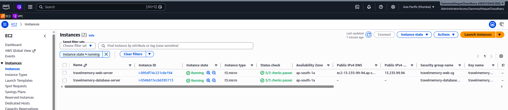

------------------------------------------------------------------------

## 6. Security Groups

Two AWS Security Groups were created.

### Web Security Group

Final inbound access:

  Port   Protocol   Source                   Purpose
  ------ ---------- ------------------------ --------------------
  22     TCP        Administrator IP `/32`   SSH administration
  80     TCP        `0.0.0.0/0`              Web application

Node.js port `3001` was temporarily available during testing but removed
from the final AWS configuration. Nginx communicates with Node.js
locally.

### Database Security Group

  Port    Protocol   Source               Purpose
  ------- ---------- -------------------- ---------------------
  22      TCP        Web Security Group   SSH through bastion
  27017   TCP        Web Security Group   MongoDB access

MongoDB is therefore not directly reachable from the internet.

### Evidence


------------------------------------------------------------------------

## 7. IAM Configuration

An EC2 IAM role and instance profile were created through Terraform.

The EC2 instances were granted the required managed permissions without
embedding AWS access keys directly on the servers.

The implementation follows the principle of using IAM roles rather than
storing long-lived AWS credentials on EC2 instances.

------------------------------------------------------------------------

## 8. Terraform Apply and Outputs

The infrastructure was provisioned using:

``` bash
terraform plan
terraform apply
```

Terraform outputs included:

-   Web server public IP.
-   Web server private IP.
-   Database server private IP.
-   VPC ID.

### Evidence

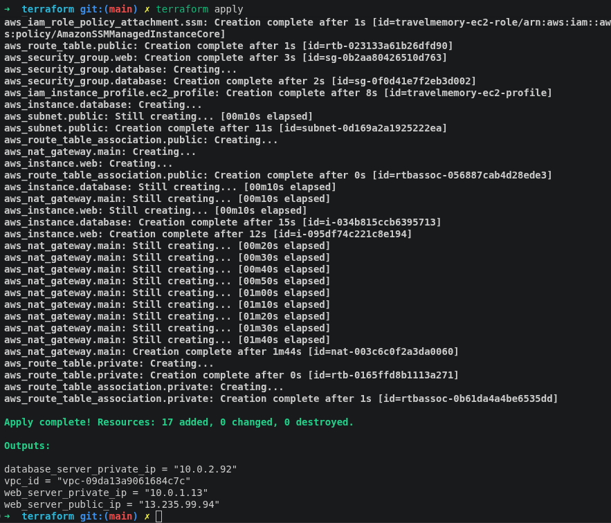

------------------------------------------------------------------------

# Part 2 - Configuration and Deployment with Ansible

## 9. Ansible Setup

Ansible was installed on the local management machine and configured
with an inventory containing the web and database servers.

``` bash
ansible --version
```

### Evidence

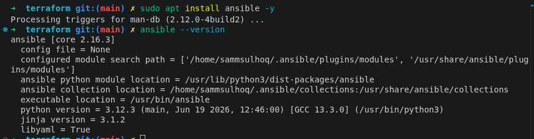

------------------------------------------------------------------------

## 10. Connecting to the EC2 Instances

The public web server is directly reachable using SSH.

The database EC2 instance has no public IP, so Ansible reaches it
through the web EC2 instance acting as a **bastion/jump host**.

``` text
Ansible Control Machine
        |
        | SSH
        v
Public Web EC2
        |
        | SSH Proxy
        v
Private Database EC2
```

Connectivity was verified using:

``` bash
ansible all -m ping
```

### Evidence

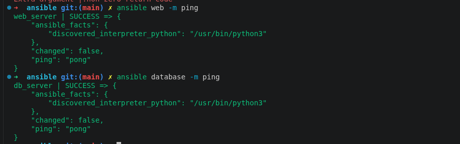

------------------------------------------------------------------------

## 11. MongoDB Installation and Configuration

Ansible performs the following operations on the private database
server:

1.  Installs the MongoDB repository signing key.
2.  Adds the MongoDB package repository.
3.  Installs MongoDB.
4.  Enables and starts `mongod`.
5.  Configures MongoDB to listen only on localhost and the private EC2
    interface.
6.  Creates an administrative MongoDB user.
7.  Creates a restricted TravelMemory application user.
8.  Enables MongoDB authentication.

MongoDB runs on:

``` text
TCP 27017
```

and AWS Security Groups and UFW restrict this port to the application
tier.

### Evidence


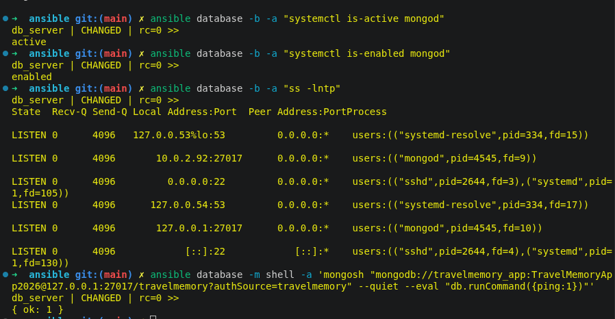

------------------------------------------------------------------------

## 12. Web Server Configuration

The web-server Ansible playbook installs:

-   Git
-   Node.js
-   NPM
-   Nginx
-   Curl
-   UFW

The TravelMemory repository is cloned to:

``` text
/opt/travelmemory
```

The resulting application structure is:

``` text
/opt/travelmemory/
├── backend/
└── frontend/
```

Backend and frontend dependencies are installed using NPM.

------------------------------------------------------------------------

## 13. Backend Configuration

The backend environment is generated through an Ansible Jinja2 template.

The important configuration values are:

``` text
PORT=3001
MONGO_URI=<authenticated private MongoDB URI>
NODE_ENV=production
```

The backend connects to the database server using its **private VPC IP
address**.

The MongoDB application account has only the permissions required to
read and write the TravelMemory database.

------------------------------------------------------------------------

## 14. Node.js Process Management

The Express backend is managed as a `systemd` service.

The service runs:

``` bash
node /opt/travelmemory/backend/index.js
```

Using systemd provides:

-   Automatic startup after reboot.
-   Automatic process restart.
-   Centralized logs through `journalctl`.
-   Consistent service management.

Example verification:

``` bash
systemctl is-active travelmemory
```

### Evidence


------------------------------------------------------------------------

## 15. React Frontend Deployment

The React frontend is configured with:

``` text
REACT_APP_BACKEND_URL=/api
```

The production application is generated using:

``` bash
npm run build
```

The generated React static files are served by Nginx instead of running
the React development server.

------------------------------------------------------------------------

## 16. Nginx Reverse Proxy

Nginx listens publicly on port `80`.

It performs two responsibilities:

1.  Serves the React production build.
2.  Proxies `/api/*` requests to the Express backend on
    `127.0.0.1:3001`.

Example request:

``` text
GET /api/trip
```

is forwarded internally to:

``` text
GET http://127.0.0.1:3001/trip
```

This allows port `3001` to remain closed to the internet.

### Evidence


------------------------------------------------------------------------

## 17. Complete Ansible Deployment

The configuration is automated through Ansible playbooks rather than
manually installing and configuring application components on each EC2
instance.

The main playbooks are:

``` text
database.yml
web.yml
security.yml
site.yml
```

`site.yml` acts as the master playbook:

``` yaml
---
- import_playbook: database.yml
- import_playbook: web.yml
- import_playbook: security.yml
```

This provides a single deployment entry point.

``` bash
ansible-playbook site.yml
```

### Evidence


------------------------------------------------------------------------

# Security Hardening

## 18. Defense in Depth

Security was implemented at multiple layers:

``` text
Internet
   |
AWS Security Groups
   |
Host Firewall (UFW)
   |
Nginx
   |
Node.js / Express
   |
Database Security Group
   |
Database UFW
   |
MongoDB Authentication
```

This prevents reliance on a single security control.

------------------------------------------------------------------------

## 19. Web Server Firewall

UFW is configured with a default-deny incoming policy.

Allowed services:

``` text
22/tcp - SSH
80/tcp - HTTP
```

AWS additionally restricts SSH port `22` to the administrator's `/32`
public IP.

### Evidence


------------------------------------------------------------------------

## 20. Database Firewall

The private database server permits only:

``` text
22/tcp    from 10.0.1.0/24
27017/tcp from 10.0.1.0/24
```

The AWS database Security Group applies a tighter restriction by
referencing the web-server Security Group directly.

### Evidence


------------------------------------------------------------------------

## 21. SSH Hardening

The following SSH security measures were applied through Ansible:

``` text
PermitRootLogin no
PasswordAuthentication no
PubkeyAuthentication yes
```

Therefore:

-   Root SSH login is disabled.
-   Password-based SSH authentication is disabled.
-   SSH key authentication is required.
-   Public web-server SSH is additionally restricted by AWS to the
    administrator's public IP.
-   The private database server is reached through the web-server
    bastion.

------------------------------------------------------------------------

## 22. MongoDB Security

MongoDB security includes:

-   No public IP on the database EC2 instance.
-   MongoDB port not exposed to the internet.
-   MongoDB authentication enabled.
-   Dedicated administrative account.
-   Separate restricted application account.
-   Private VPC communication between Express and MongoDB.
-   AWS Security Group restriction.
-   UFW restriction.

------------------------------------------------------------------------

## 23. Secret Management

Sensitive Ansible variables can be encrypted using Ansible Vault:

``` bash
ansible-vault encrypt group_vars/all.yml
```

After encryption, the deployment is executed with:

``` bash
ansible-playbook site.yml --ask-vault-pass
```

The Vault password must **not** be committed to source control.

------------------------------------------------------------------------

# End-to-End Application Verification

## 24. Backend Verification

The Express health endpoint can be tested locally on the web server:

``` bash
curl http://127.0.0.1:3001/hello
```

The externally accessible Nginx route can be tested using:

``` bash
curl http://<WEB_PUBLIC_IP>/api/hello
```

The direct public Node.js route is intentionally unavailable:

``` text
http://<WEB_PUBLIC_IP>:3001
```

This verifies that users must communicate through Nginx.

------------------------------------------------------------------------

## 25. Database Integration Verification

The following endpoint verifies the complete backend-to-database path:

``` bash
curl http://<WEB_PUBLIC_IP>/api/trip
```

Request flow:

``` text
Client
  |
  v
Nginx :80
  |
  v
Express :3001
  |
  v
MongoDB :27017
```

------------------------------------------------------------------------

## 26. Working MERN Application

The application is accessed through:

``` text
http://<WEB_PUBLIC_IP>
```

The React application is served by Nginx.

Creating and saving a TravelMemory record demonstrates the full request
path:

``` text
React
  |
  v
Nginx
  |
  v
Express
  |
  v
MongoDB
```

Refreshing the page and observing that the saved record remains verifies
MongoDB persistence.

### Evidence


------------------------------------------------------------------------

# Project Structure

``` text
travelmemory-devops/
│
├── terraform/
│   ├── providers.tf
│   ├── variables.tf
│   ├── network.tf
│   ├── security.tf
│   ├── iam.tf
│   ├── ec2.tf
│   ├── outputs.tf
│   └── terraform.tfvars
│
├── ansible/
│   ├── ansible.cfg
│   ├── inventory.ini
│   ├── database.yml
│   ├── web.yml
│   ├── security.yml
│   ├── site.yml
│   │
│   ├── group_vars/
│   │   └── all.yml
│   │
│   └── templates/
│       ├── mongod.conf.j2
│       ├── backend.env.j2
│       ├── travelmemory.service.j2
│       └── nginx-travelmemory.conf.j2
│
├── screenshots/
│   ├── 01-aws-cli-configured.png
│   ├── 02-terraform-init.png
│   ├── 03-terraform-validate.png
│   ├── 04-terraform-apply.png
│   ├── 05-vpc.png
│   ├── 06-subnets.png
│   ├── 07-route-tables.png
│   ├── 08-nat-gateway.png
│   ├── 10-ec2-instances.png
│   ├── 11-ansible-version.png
│   ├── 12-ansible-connectivity.png
│   ├── 13-mongodb-install-playbook.png
│   ├── 14-mongodb-authentication.png
│   ├── 15-backend-running.png
│   ├── 16-nginx-backend-test.png
│   ├── 17-full-ansible-playbook-success.png
│   ├── 18-mongodb-running.png
│   ├── 19-ufw-web.png
│   ├── 20-ufw-database.png
│   ├── 21-travelmemory-homepage.png
│   ├── 22-travelmemory-add-memory.png
│   ├── 23-travelmemory-saved-memory.png
│   ├── 24-web-security-group-final.png
│   └── 25-database-security-group-final.png
│
└── README.md
```

> `terraform.tfvars`, SSH private keys, plaintext secrets, and Ansible
> Vault password files should not be committed to a public repository.

------------------------------------------------------------------------

# Key Terraform Commands

``` bash
terraform init
terraform fmt
terraform validate
terraform plan
terraform apply
terraform output
```

To remove the infrastructure after the assignment:

``` bash
terraform destroy
```

This is especially important because resources such as the NAT Gateway
can continue to incur AWS charges while provisioned.

------------------------------------------------------------------------

# Key Ansible Commands

Verify all managed hosts:

``` bash
ansible all -m ping
```

Deploy MongoDB:

``` bash
ansible-playbook database.yml
```

Deploy the web/application server:

``` bash
ansible-playbook web.yml
```

Apply security hardening:

``` bash
ansible-playbook security.yml
```

Run the complete configuration:

``` bash
ansible-playbook site.yml
```

When Ansible Vault is enabled:

``` bash
ansible-playbook site.yml --ask-vault-pass
```

------------------------------------------------------------------------

# Troubleshooting Encountered

## SSH Timeout to Public EC2

An SSH timeout occurred because the web Security Group contained an
outdated administrator public IP.

The Security Group allowed:

``` text
203.0.113.25/32
```

while the current administrator public IP had changed.

The `my_ip` Terraform variable was updated to the current `/32` address
and `terraform apply` was run again.

This restored SSH and Ansible connectivity while retaining the security
requirement that SSH not be open globally.

### Lesson

Dynamic residential/public IP addresses can change. When SSH is
restricted to a `/32` source, the Security Group must contain the
current administrator public IP.

------------------------------------------------------------------------

## Private EC2 Ansible Connectivity

The database server could not be reached directly because it
intentionally has no public IP.

Ansible was configured to use the web EC2 instance as a bastion.

A standard ProxyJump initially failed because the required SSH key was
not being selected for the bastion connection. An explicit SSH
`ProxyCommand` with the correct identity file resolved the problem.

This allowed:

``` text
Ansible machine
      |
      v
Web EC2
      |
      v
Private DB EC2
```

without exposing the database server publicly.

------------------------------------------------------------------------

# Deliverables

This repository contains the required assignment deliverables:

### Terraform Infrastructure Scripts

Terraform provisions:

-   VPC
-   Public subnet
-   Private subnet
-   Internet Gateway
-   NAT Gateway
-   Route tables
-   Security Groups
-   IAM role / instance profile
-   Web EC2
-   Database EC2
-   Infrastructure outputs

### Ansible Playbooks

Ansible performs:

-   MongoDB installation and security configuration
-   Node.js and NPM installation
-   Repository deployment
-   Backend environment configuration
-   React production build
-   systemd service configuration
-   Nginx reverse proxy configuration
-   UFW firewall configuration
-   SSH hardening

### Implementation Documentation

This README documents:

-   Infrastructure design
-   Application architecture
-   Deployment process
-   Networking
-   Component interactions
-   Security controls
-   Troubleshooting
-   Validation

### Working Application Evidence

Screenshots demonstrate:

-   AWS infrastructure
-   Terraform execution
-   Ansible connectivity
-   MongoDB deployment
-   Application services
-   Security configuration
-   Working React application
-   Persistent application data

------------------------------------------------------------------------

# Final Result

The TravelMemory MERN application was successfully deployed using an
automated infrastructure and configuration-management workflow.

The final architecture provides the following separation of
responsibilities:

``` text
Terraform
    |
    v
AWS Infrastructure
    |
    v
Ansible
    |
    +-------------------+
    |                   |
    v                   v
Web/Application EC2   Database EC2
    |                   |
    v                   v
Nginx                 MongoDB
React                 Authentication
Node.js               Private networking
```

The implementation demonstrates Infrastructure as Code, configuration
management, network isolation, reverse proxying, secure database
communication, service management, and defense-in-depth security
practices.

------------------------------------------------------------------------

## Cleanup

After completing the assignment and capturing all required evidence, AWS
resources can be removed with:

``` bash
cd terraform
terraform destroy
```

Review the destruction plan and confirm only when the assignment no
longer requires the environment.

This prevents unnecessary AWS charges, particularly from the NAT Gateway
and EC2 resources.
